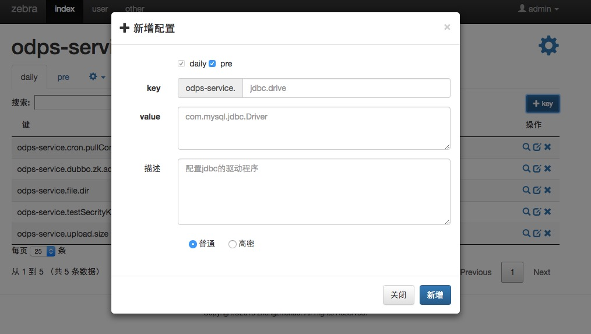

# xconfig

## 简介

基于zookeeper的配置中心，统一存储应用的配置，可以解决项目中各种环境（profile）的配置文件分散，难以维护问题。可以主动推送配置变化信息，让应用实时感知配置变化。

## 名词解释

* project 表示一个项目，比如user-web,mysql。
* profile 表示一个项目的不同环境（maven中也用profile来区分环境），比如user-web分为dev，alpha，beta，pre，prd环境。
* key 表示一个配置项，与properties文件中的key一直，xconfig中的key值都是以project开头的，比如user-web中的key为：user-web.size,user-web.tag。
* value 表示一个value值。
* 依赖 为了简化配置，project允许依赖（只有一层依赖），比如user-web可能要用到mysql数据，可以设置user-web依赖mysql，项目启动时拉取user-web配置会将其依赖的mysql配置也加入进来。

## web界面预览

* 所见即所得，所有配置项都能在web界面中看到（其中高密的value会被隐藏，需要一定权限），方便项目开发时候使用。
* 提供模糊匹配筛选功能，能够快速筛选想看的key。
* 修改value会实时（准实时）推送到应用中。
* xconfig-server支持部署多台。

## xconfig部署

* 需要zk和mysql数据库支持。
* jdk版本1.7。
* maven3。
* 部署步骤（目前我只在linux上面部署，如果是window可能需要作出相应调整）
	1. 下载源代码。
	2. install到maven仓库。在xconfig目录下，执行：mvn install -DskipTests=true。
	3. 修改xconfig-server配置。修改xconfig/xconfig-server/config/xconfig.properties文件，将其中配置信息修改为自己的。其中如果不需要对zk节点使用acl权限，zkUserName,zkPassword可以设置为空。
	4. 生成war包。在xconfig-server目录下，执行：mvn clean compile package -Pprd，会在xconfig-server/target目录下生成war包。
	5. 将war部署到web容器，请将web部署到容器根目录。（其中一种部署方式，tomcat的server.xml中增加context：`<Context path="" docBase="../war/xconfig-server.war" debug="0" reloadable="true"/>`）。
	6. xconfig-server可以部署多台，多台部署的时候前面需要ngnix之类的反向代理工具，这里就不再赘述。
	7. 部署成功之后页面，localhost:8080，使用默认用户名密码登录：admin/admin。
	8. 请先在右上角修改密码。
* xconfig-server启动之后，会自动将mysql中的配置信息同步到zk，之后每隔一段时间（目前是20分钟），都会自动将mysql的配置与zk同步（作为一种容错方式）。

## xconfig-server的使用

* 权限角色说明。
	* 系统内置了三个权限，分别为guest，owner，master。
	* 系统内置admin为master权限，admin可以在用户管理页面增加用户，新增用户可以选择为guest和master。
	* master默认拥有所有project的所有权限，增删改查。
	* guest拥有所有project的查看权限。
	* master可以指定某个项目的owner，将guest用户选为某个项目的owner。owner拥有相应项目的所有权限。
	* 高密字段只有master和owner才能看到真实的value值。
	
* 界面操作（略）。
* project的依赖只有一层，不存在依赖传递等问题。

## client如何使用

1. 引入jar

	    <groupId>com.zebra.carcloud</groupId>
	    <artifactId>xconfig-client</artifactId>
	    <version>0.0.1-SNAPSHOT</version>

2. spring中如何配置
		  
		  <!-- 依赖的project -->
        <bean id="xConfig" class="com.zebra.xconfig.client.XConfig" init-method="init">
            <property name="project" value="odps-service"></property>
        </bean>

	    <!-- 与spring结合的工具类，支持${}获取属性值 -->
        <bean class="com.zebra.xconfig.client.XConfigPropertyPlaceholderConfigurer">
            <property name="XConfig" ref="xConfig"/>
        </bean>
        
	    <!-- eg:注入自定义的bean -->
        <bean id="mysqlConf" class="com.zebra.xconfig.client.MysqlConf">
            <property name="password" value="${mysql.jdbc.password}"></property>
        </bean>

        <!-- eg:数据源配置 -->
        <bean id="dataSource" class="org.apache.commons.dbcp.BasicDataSource" destroy-method="close">
            <property name="driverClassName" value="${mysql.jdbc.driver}"></property>
            <property name="url" value="${mysql.jdbc.url}"></property>
            <property name="username" value="${mysql.jdbc.username}"></property>
            <property name="password" value="${mysql.jdbc.password}"></property>
        </bean>

3. 指定profile等配置信息，有两种配置方式。

	1. 公共配置(需要管理员统一配置)。默认读取当前用户目录下（~/.xconfig/config.properties）文件，其中有zk连接串，用户名信息，以及当前机器所属的环境。eg:/Users/ying/.xconfig/config.preperties。
	
		    profile=daily
		    zkConn=localhost:2181
		    userName=xconfig
		    password=xconfig
		
		
		* userName,password需要与xconfig-web部署的时候指定的一致，这个是zk节点的访问权限信息，如果xconfig-server没有指定，这里也可以不设置。
		* 当前机器上使用xconfig的项目都会读取这个配置文件。
	
		>  这种配置方式，符合大部分项目部署的情况，一般不存在一个机器同时部署两个环境等情况。统一部署的时候推荐使用这种方式。
		
	2. 使用jvm启动参数配置。jvm启动的时候可以指定启动参数。
	
		    -Dxconfig.profile=beta
		    -Dxconfig.zkConn=localhost:2181
		    -DuserName=xconfig
		    -Dpassword=xconfig
		
		* 以上参数可以单独指定，配置遵循就近覆盖原则，jvm参数将会覆盖掉公共配置。比如我启动的时候单独使用了-Dxconfig.profile=beta，那么client的其他参数扔使用公共配置，但是profile会使用beta。（userName,password只会统一取一处配置）。
		
		> 此种方式比较适合本地测试，单独指定配置文件。
	
	
4. 编程式获取配置信息。配置信息将会在client中缓存一份，并且会实时更新，可以通过下面这种方式编程式获取配置信息。

	    XConfig.getValue("mysql.jdbc.password");
	    XConfig.getValue("mysql.jdbc.password","defaultValue");

	* 最佳实践，强烈建议使用这种方式获取配置值，不建议自己缓存一份value使用，使用此方法总是能够获取到最新的配置。
	* 不可避免的我们有时候需要知道配置发生变化，xconfig也提供了监听器来感知这种变化。
	
5. 注册key监听，感知配置变化。

	    XConfig.addObserver(new XKeyObserver() {
            @Override
            public String getKey() {
                return "mysql.jdbc.password";
            }

            @Override
            public void change(String value) {
                logger.debug("===change===>{}:{}",getKey(),value);
            }
        });

	* 在频繁更新某个value的情况下，zk会保证client得到的value的最终一致性，此监听器中的回调方法也一样。当你需要在新线程中处理value变化的时候，需要你自己来保证一致性。
	* 建议回调方法中不要做耗时操作。
    
6. 本地模式。为了方便本地调试和能够手动干预配置，client初始化的时候会检测对应配置目录的local.preperties文件（eg:/Users/ying/.xconfig/odps-service_daily/local.propreties）。如果此文件存在，client将启动单机模式，直接使用此配置文件启动，不再连接zk。

7. 容错。client启动的时候，zk如果在一定时间连接不上，client会尝试使用current.properties，和root.propreties文件启动。

# 设计

1. 整体结构
	* zk为中心，即便是xconfig-server挂了也不会影响应用端。
	* client本地会缓存boot.properties（当前应用启动时候快照）,current.properties（实时快照）文件。
	

2. 时序图
	
	
3. 数据库设计
	
	
	
3. zk节点结构图
	
	
4. 思维导图
	
	
5. 性能测试
